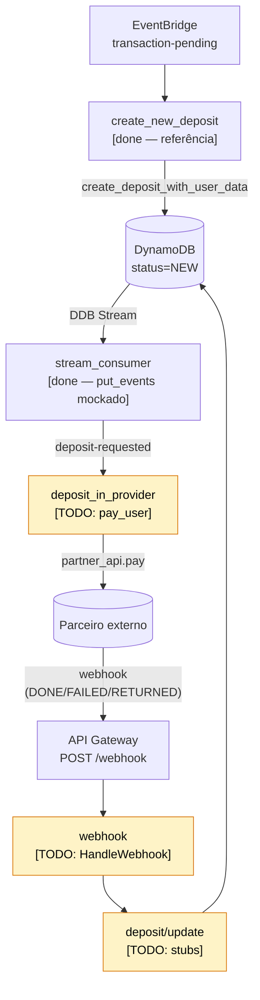

# Desafio: Instant Deposits

Serviço serverless que processa depósitos instantâneos: recebe eventos via EventBridge, persiste em DynamoDB, dispara pagamentos a um parceiro externo e reflete o resultado de volta no depósito. Implementação disponível em mais de uma linguagem — escolha a sua em [`README.md`](./README.md).

## Objetivo

Mais do que o código pronto, queremos entender **como você usa IA para navegar e modificar um código que não é seu**. Use IA livremente. Na conversa final, o que diferencia é você conseguir explicar as decisões que tomou (e as que delegou pra IA), inclusive aquelas que descartou no meio do caminho.

Não tem problema não terminar tudo.

## Sua tarefa

Complete o ciclo de vida de um depósito:

1. Após a criação, disparar o pagamento no parceiro.
2. Ao receber o webhook de retorno do parceiro, refletir o resultado no estado do depósito (sucesso, falha, devolvido).

Não é necessário conhecimento prévio de DynamoDB ou EventBridge — os eventos chegam parseados como entrada do lambda. O padrão de acesso ao DynamoDB está demonstrado em `create_new_deposit/`, que serve como referência (handler + testes de integração + acesso a dados).

## Estrutura

| Componente                | Estado                                                                                  |
| ------------------------- | --------------------------------------------------------------------------------------- |
| `create_new_deposit/`     | implementado (referência)                                                               |
| `stream_consumer/`        | implementado — publicação no EventBridge é mockada via log (tratar como suficiente)     |
| `deposit_in_provider/`    | só falta `PayUser` — handler do lambda já pronto                                        |
| `webhook/`                | só falta `HandleWebhook(body)` — structs (`Body`/`Data`) e handler HTTP já prontos      |
| `deposit/src/update.go`   | stubs: `UpdateDepositStatus`, `UpdateDepositAsFailed`, `ValidateStatusChange`           |
| `partner_api/`            | implementado — consumir, não reimplementar                                              |

Os nomes acima usam `snake_case` por consistência. Em linguagens de convenção PascalCase (como Go), os equivalentes idiomáticos são `PayUser`, `HandleWebhook`, `UpdateDepositStatus`, etc.

### `webhook/` — o que já está pronto

- **Structs do payload** (`Body`, `Data`) e constantes dos status do parceiro (`DONE`, `FAILED`, `RETURNED`). Não redefina.
- **Handler HTTP**: parse do request, mapeamento para status code (200/403/500) e tratamento dos erros que vêm de `deposit`. Não é preciso mexer aqui — leia para entender o contrato que `handle_webhook` precisa respeitar.

A única coisa a implementar é o corpo de `handle_webhook(body)`. O handler externo traduz o erro (ou ausência dele) que você devolver para a resposta HTTP.

## Fluxo atual



## Como rodar

Abra no Codespaces (o devcontainer já configura Go, Node, Python, Java, AWS CLI e DynamoDB Local) ou rode localmente:

```bash
cd go
npm install
./test.sh           # Go + DynamoDB Local
npm run test:cdk    # CDK
```

`./test.sh` sobe DynamoDB Local e exporta `AWS_ENDPOINT_URL_DYNAMODB` + `TABLE_NAME` antes de chamar `go test`. Se rodar `go test ./...` diretamente, os testes de integração pulam silenciosamente por falta dessas variáveis — use sempre o wrapper.
