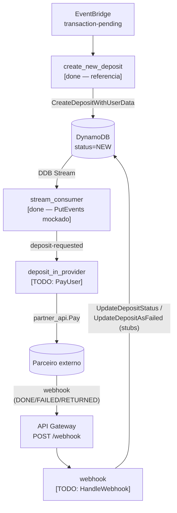

# Desafio: Instant Deposits

Serviço serverless em Go que processa depósitos instantâneos: recebe eventos via EventBridge, persiste em DynamoDB, dispara pagamentos a um parceiro externo e reflete o resultado de volta no depósito.

## Objetivo

Este desafio avalia tanto a entrega técnica quanto **como você usa IA para entender e modificar um código que não é seu**. Use IA livremente — explorar o código, propor desenhos, gerar testes, refatorar — e esteja pronto para explicar as decisões que tomou (e as que delegou). O que nos interessa não é a quantidade de código gerado, mas o critério com que você dirigiu a ferramenta.

## Sua tarefa

Complete o ciclo de vida de um depósito:

1. Após a criação, disparar o pagamento no parceiro.
2. Ao receber o webhook de retorno do parceiro, refletir o resultado no estado do depósito (sucesso, falha, devolvido).

Cubra o fluxo com testes. O lambda `create_new_deposit/` está completo e serve como referência (handler + testes de integração + acesso a dados).

## Estrutura

| Componente                | Estado                                                                                  |
| ------------------------- | --------------------------------------------------------------------------------------- |
| `create_new_deposit/`     | implementado (referência)                                                               |
| `deposit_in_provider/`    | incompleto — `PayUser` é stub                                                           |
| `webhook/`                | incompleto — `HandleWebhook` é stub                                                     |
| `partner_api/`            | implementado — consumir, não reimplementar                                              |
| `deposit/src/update.go`   | stubs: `UpdateDepositStatus`, `UpdateDepositAsFailed`, `ValidateStatusChange`           |
| `stream_consumer/`        | implementado — publicação no EventBridge é mockada via log (tratar como suficiente)     |

## Fluxo atual



## Como rodar

Abra no Codespaces (o devcontainer já configura Go, Node, Java e AWS CLI) ou rode localmente:

```bash
cd go
npm install
npm test            # Go + DynamoDB Local
npm run test:cdk    # CDK
```

`npm test` sobe DynamoDB Local e exporta `AWS_ENDPOINT_URL_DYNAMODB` antes de chamar `go test`. Se rodar `go test ./...` diretamente, os testes de integração pulam silenciosamente por falta dessa variável — use sempre o wrapper.
