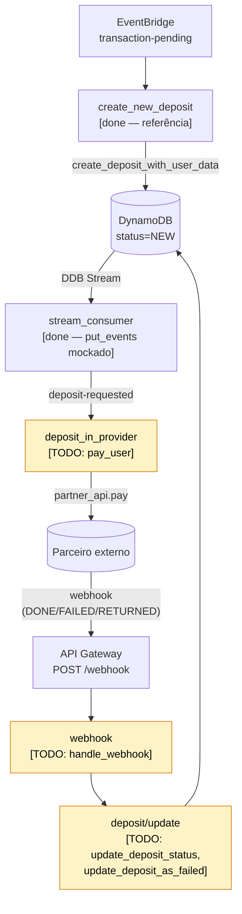

# Desafio: Instant Deposits

Serviço serverless que processa depósitos instantâneos: recebe eventos via EventBridge, persiste em DynamoDB, dispara pagamentos a um parceiro externo e reflete o resultado de volta no depósito. Implementação disponível em mais de uma linguagem — escolha a sua em [`README.md`](./README.md).

## Objetivo

Este desafio avalia tanto a entrega técnica quanto **como você usa IA para entender e modificar um código que não é seu**. Use IA livremente e esteja pronto para explicar as decisões que tomou (e as que delegou).

## Sua tarefa

Complete o ciclo de vida de um depósito:

1. Após a criação, disparar o pagamento no parceiro.
2. Ao receber o webhook de retorno do parceiro, refletir o resultado no estado do depósito (sucesso, falha, devolvido).

Não é necessário conhecimento prévio de DynamoDB ou EventBridge: os eventos chegam parseados como entrada do lambda, e o padrão de acesso ao DynamoDB já está demonstrado em `create_new_deposit/`, que está completo e serve como referência (handler + testes de integração + acesso a dados).

## Estrutura

| Componente              | Estado                                                                                 |
| ----------------------- | -------------------------------------------------------------------------------------- |
| `create_new_deposit/`   | implementado (referência)                                                              |
| `deposit_in_provider/`  | incompleto — a função `pay_user` é stub                                                |
| `webhook/`              | incompleto — a função `handle_webhook` é stub                                          |
| `partner_api/`          | implementado — consumir, não reimplementar                                             |
| `deposit/update.*`      | stubs: `update_deposit_status`, `update_deposit_as_failed`, `validate_status_change`   |
| `stream_consumer/`      | implementado — publicação no EventBridge é mockada via log (tratar como suficiente)    |

Os nomes acima usam `snake_case` por consistência. Em linguagens de convenção PascalCase (como Go), os equivalentes idiomáticos são `PayUser`, `HandleWebhook`, `UpdateDepositStatus`, etc.

### `webhook/` — o que já está pronto

- **Structs do payload** (`Body`, `Data`) e constantes dos status do parceiro (`DONE`, `FAILED`, `RETURNED`). Não redefina.
- **Handler HTTP**: parse do request, mapeamento para status code (200/403/500) e tratamento dos erros que vêm de `deposit`. Não é preciso mexer aqui — leia para entender o contrato que `handle_webhook` precisa respeitar.

A única coisa a implementar é o corpo de `handle_webhook(body)`. O handler externo traduz o erro (ou ausência dele) que você devolver para a resposta HTTP.

## Fluxo atual



## Como rodar

Abra no Codespaces (o devcontainer já configura Go, Node, Python, Java, AWS CLI e DynamoDB Local) ou rode localmente:

```bash
cd <lang>           # go ou python
./test.sh           # boot DynamoDB Local + roda os testes do app

cd cdk && npm install && npm run test:cdk    # testes da stack CDK (TS)
```

`./test.sh` sobe DynamoDB Local e exporta `AWS_ENDPOINT_URL_DYNAMODB` + `TABLE_NAME` antes de chamar o runner nativo da linguagem. Se rodar o runner direto, os testes de integração pulam silenciosamente por falta dessas variáveis — use sempre o wrapper.
