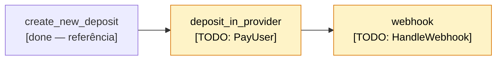

# Desafio: Instant Deposits

Serviço serverless em Go que processa depósitos instantâneos: a partir de um evento de criação, dispara o pagamento em um parceiro externo e reflete o resultado de volta no depósito quando o webhook chega.

## Objetivo

Mais do que o código pronto, queremos entender **como você usa IA para navegar e modificar um código que não é seu**. Use IA livremente. **Nosso objetivo principal é entender como você resolve problemas específicos com a ajuda de IA**. O código final importa menos do que esse processo.

## Sua tarefa

Complete o ciclo de vida de um depósito:

1. Após a criação, disparar o pagamento no parceiro.
2. Ao receber o webhook de retorno do parceiro, refletir o resultado no estado do depósito (sucesso, falha, devolvido).

Não é necessário conhecimento prévio de DynamoDB — os eventos chegam parseados como entrada do lambda. O padrão de acesso ao DynamoDB está demonstrado em `create_new_deposit/`, que serve como referência (handler + testes de integração + acesso a dados).

## Estrutura

| Componente                                | Estado                                                                  |
| ----------------------------------------- | ----------------------------------------------------------------------- |
| `create_new_deposit/`                     | implementado (referência)                                               |
| `partner_api/`                            | implementado; ver [`go/docs/partner-api.md`](./go/docs/partner-api.md)  |
| `deposit_in_provider/src/pay_user.go`     | **TODO: `PayUser`**                                                     |
| `webhook/src/webhook.go`                  | **TODO: `HandleWebhook(body)`**                                         |

## Fluxo atual



## Como rodar

> Para usar o GitHub Codespaces você precisa estar **logado no GitHub** antes de criar o ambiente — sem isso o Codespace não inicia.

Abra no Codespaces (o devcontainer já configura Go, Node, Java, AWS CLI e DynamoDB Local) ou rode localmente:

```bash
cd go
npm install
./test.sh           # Go + DynamoDB Local
npm run test:cdk    # CDK
```

`./test.sh` sobe DynamoDB Local e exporta `AWS_ENDPOINT_URL_DYNAMODB` + `TABLE_NAME` antes de chamar `go test`. Se rodar `go test ./...` diretamente, os testes de integração pulam silenciosamente por falta dessas variáveis — use sempre o wrapper.
